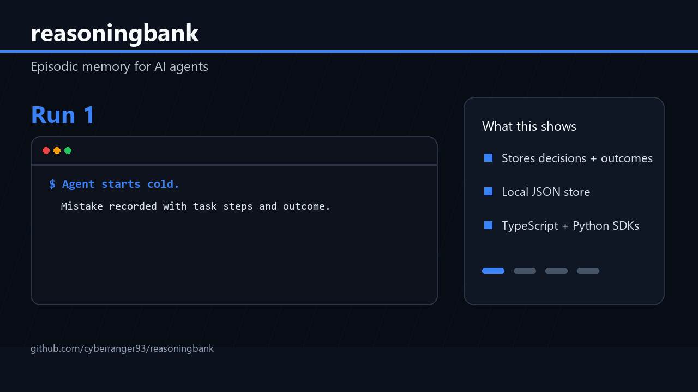

# reasoningbank

> Shared learning pool for AI agents — every run makes all future runs smarter.

[](https://npmjs.com/package/reasoningbank)
[](https://github.com/cyberranger93/reasoningbank)
[](LICENSE)

<!-- hero GIF: success rate graph climbing across 5 runs -->
<!--  -->

## The problem

Your AI agents start from scratch every single run. They repeat the same mistakes. They forget what worked last time. Fine-tuning is expensive. RAG retrieves documents — not decision patterns.

**ReasoningBank fills the gap:** it stores agent trajectory decisions (what steps were taken, which worked, which failed) and surfaces them to future agents before they run — like cross-agent episodic memory.

## Quick Start

```bash
# Start the ReasoningBank server
npx reasoningbank

# Server is now at http://localhost:8001
```

### Python (10 lines)

```python
from reasoningbank import ReasoningBank
rb = ReasoningBank()

# Before running your agent:
hints = rb.suggest("research LLM pricing options")
# → hints = past steps that worked for similar tasks

# While running:
session = rb.start("research LLM pricing options")
rb.step(session, "searched web", "found 5 providers")
rb.step(session, "compared pricing tables", "OpenAI cheapest for short context")
rb.end(session, outcome="success", score=0.9)
```

Install: `pip install reasoningbank`

### TypeScript (10 lines)

```typescript
import { ReasoningBank } from "reasoningbank/sdk"
const rb = new ReasoningBank()

const hints = await rb.suggest("research LLM pricing")
const session = await rb.start("research LLM pricing")
await rb.step(session, "searched web", "found 5 providers")
await rb.end(session, { outcome: "success", score: 0.9 })
```

## REST API

```bash
# Start session
POST /trajectory/start
{"task_description": "...", "agent_id": "optional"}

# Add step
POST /trajectory/step
{"session_id": "...", "action": "...", "result": "..."}

# End session
POST /trajectory/end
{"session_id": "...", "outcome": "success|failure|partial", "score": 0.9}

# Get suggestions for a new task
POST /suggest
{"task_description": "...", "limit": 5}

# Stats
GET /stats
```

## How It Works

```
Run 1:  agent runs task → steps recorded → outcome stored
Run 2:  agent queries /suggest → gets relevant past steps → fewer mistakes
Run 3+: agents converge on successful patterns → success rate improves
```

No retraining. No fine-tuning. No vector database required (SQLite, local, zero infra).

## Why This vs Alternatives

| | ReasoningBank | RAG | Fine-tuning | In-context memory |
|---|---|---|---|---|
| Stores decision patterns | ✅ | ❌ (docs only) | ✅ | ✅ |
| Persists across sessions | ✅ | ✅ | ✅ | ❌ |
| Cross-agent sharing | ✅ | ❌ | ✅ | ❌ |
| Zero infra (local SQLite) | ✅ | ❌ | ❌ | ✅ |
| Works with any LLM | ✅ | ✅ | ❌ | ✅ |
| Cost to set up | Free | $$ | $$$$ | Free |

## Data

All data stored locally at `~/.reasoningbank/trajectories.db` (SQLite). No external services. Override with `REASONINGBANK_DATA_DIR`.

## Examples

See [`examples/`](examples/) for:
- Groq agent loop with ReasoningBank
- Claude agent via SDK
- n8n workflow integration

## Contributing

PRs welcome. See [CONTRIBUTING.md](CONTRIBUTING.md).

[Good first issues →](https://github.com/cyberranger93/reasoningbank/labels/good%20first%20issue)

## License

MIT © CyberRanger93
